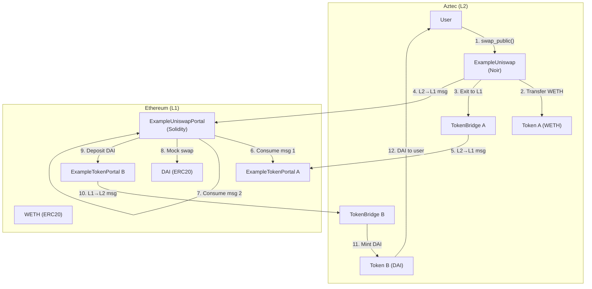

## Why Build a Cross-Chain Swap?

DeFi liquidity lives on Ethereum L1. Users with tokens on Aztec L2 need a way to access L1 DEXs like Uniswap without manually bridging tokens back and forth. A cross-chain swap automates this: the user initiates the swap on L2, and the protocol handles exiting to L1, performing the swap, and depositing the output back to L2.

This tutorial walks you through building a version of this flow. You will learn how **L2-to-L1 messages** work and how multiple contracts across two chains coordinate to execute a single user action.

Before starting, make sure you have the Aztec local network running at version #include_aztec_version. Check out [the local network guide](../../../getting_started_on_local_network.md) for setup instructions.

## What You'll Build

Each swap generates **two L2-to-L1 messages**:

1. **Token bridge exit** - Instructs the token portal to release input tokens to the uniswap portal
2. **Swap intent** - Proves the user authorized this exact swap with these exact parameters

Both messages must be consumed on L1 before the swap executes. This two-message pattern prevents anyone from stealing funds or changing swap parameters.

### Why Two Messages?

The two-message pattern provides **separation of concerns** and **defense in depth**:

1. **Token bridge exit** - Authorizes releasing tokens from the bridge to the uniswap portal
2. **Swap intent** - Proves the user authorized *this specific swap* with *these exact parameters*

Neither message alone is sufficient. If only the token exit existed, anyone observing it could potentially redirect the swap. If only the swap intent existed, there would be no proof that tokens were actually withdrawn. Together, they create a cryptographic chain of authorization.

This pattern is common in Aztec cross-chain applications where multiple independent systems must coordinate.

## Part 1: Token Portal (Solidity)

The token portal handles depositing tokens from L1 to L2 and withdrawing from L2 to L1. This version hardcodes `caller_on_l1` to `address(0)` (meaning anyone can execute the withdrawal).

#include_code example_token_portal /docs/examples/solidity/example_swap/ExampleTokenPortal.sol solidity

Key functions:

- `depositToAztecPublic` - Locks ERC20 tokens and sends an L1→L2 message for public minting
- `depositToAztecPrivate` - Same but for private minting
- `withdraw` - Consumes an L2→L1 message and releases tokens

The registry provides governance-updateable addresses for core Aztec contracts. Rather than hardcoding rollup addresses, portals query the registry, allowing the protocol to upgrade without redeploying all portals.

The content hash in each function uses `abi.encodeWithSignature` to include a function selector. This makes each message type unique, preventing a deposit message from being confused with a withdrawal message.

#include_code deposit_to_aztec_public /docs/examples/solidity/example_swap/ExampleTokenPortal.sol solidity

#include_code withdraw /docs/examples/solidity/example_swap/ExampleTokenPortal.sol solidity

## Part 2: Uniswap Portal (Solidity)

The uniswap portal orchestrates the swap on L1. It consumes two L2→L1 messages, performs the swap, and deposits the output back to L2.

:::note Mock Swap
This tutorial uses a mock 1:1 swap instead of a real Uniswap V3 router. The portal must be pre-funded with output tokens. The important part is the **message-passing pattern**, not the swap itself.
:::

#include_code example_uniswap_portal /docs/examples/solidity/example_swap/ExampleUniswapPortal.sol solidity

The public swap function consumes two messages and deposits the output:

#include_code swap_public /docs/examples/solidity/example_swap/ExampleUniswapPortal.sol solidity

The private swap follows the same pattern but deposits output tokens privately:

#include_code swap_private /docs/examples/solidity/example_swap/ExampleUniswapPortal.sol solidity

## Part 3: Uniswap Contract (Noir)

The L2 contract handles the user-facing logic: transferring input tokens, calling the bridge to exit to L1, and creating the swap intent message.

### Setup

The contract stores the portal address and imports the `Token` and `TokenBridge` contracts:

#include_code example_uniswap_setup /docs/examples/contracts/example_uniswap/src/main.nr rust

### Public Swap

The public swap transfers tokens from the sender to the contract, exits them to L1 via the bridge, and sends a swap intent message:

:::note Authorization Witnesses
Aztec uses **authorization witnesses** (authwit) instead of the ERC20 approve/transferFrom pattern. The contract computes the hash of the exact action it wants to perform, sets that hash as authorized, then immediately performs the action. This gives fine-grained control - the authorization is for a specific action, not a blanket approval. Since we authorize and spend in the same transaction, replay attacks are impossible.
:::

#include_code swap_public /docs/examples/contracts/example_uniswap/src/main.nr rust

### Private Swap

The private swap is similar but uses `transfer_to_public` (private to public transfer) and `enqueue_self` instead of `call_self`:

#include_code swap_private /docs/examples/contracts/example_uniswap/src/main.nr rust

:::note Why no recipient parameter?
In `swap_private`, the recipient is the transaction sender (implicit). This preserves privacy: revealing a recipient address to L1 would compromise the caller's identity. The output tokens are deposited privately on L2, where only the caller can claim them.
:::

### Bridge Helper

Both flows share this internal function that approves the bridge to burn tokens and exits them to L1:

#include_code approve_bridge_and_exit /docs/examples/contracts/example_uniswap/src/main.nr rust

:::note Portal Address Validation
The portal address checks are a **safety mechanism**. If either portal is zero (not configured), the funds would be permanently lost. Always validate external addresses before sending irreversible messages.
:::

:::note Fixed nonce safety
The fixed nonce `0xdeadbeef` used throughout this contract is safe because authorization and token spending occur in the same transaction. There's no opportunity for replay attacks since the authorization is set and consumed atomically.
:::

### Content Hash Helpers

These content hashes form the **cross-chain contract interface**. The L2 contract computes a hash of all swap parameters, and the L1 portal reconstructs the same hash from the parameters it receives. If they don't match exactly, the message consumption fails.

This is how L1 verifies that L2 actually authorized the swap - not by trusting a signature, but by independently computing what the message should contain. The hashes must match exactly between L2 (Noir) and L1 (Solidity):

#include_code swap_public_content_hash /docs/examples/contracts/example_uniswap/src/util.nr rust

#include_code swap_private_content_hash /docs/examples/contracts/example_uniswap/src/util.nr rust

## Part 4: Public Swap Flow (TypeScript)

Now you can tie everything together in a TypeScript script. Start by setting up clients and deploying all contracts:

#include_code setup /docs/examples/ts/example_swap/index.ts typescript

### Deploy L1 Contracts

Deploy two ERC20 tokens, two token portals, and the uniswap portal:

#include_code deploy_l1 /docs/examples/ts/example_swap/index.ts typescript

### Deploy L2 Contracts

Deploy L2 tokens (using `TokenContract` from `@aztec/noir-contracts.js`), bridges, and the uniswap contract:

#include_code deploy_l2 /docs/examples/ts/example_swap/index.ts typescript

### Initialize and Fund

Initialize all portals and mint tokens:

#include_code initialize /docs/examples/ts/example_swap/index.ts typescript

Fund the user with input tokens and pre-fund the uniswap portal with output tokens:

#include_code fund /docs/examples/ts/example_swap/index.ts typescript

### Deposit to L2

Bridge WETH from L1 to L2:

#include_code deposit_to_l2 /docs/examples/ts/example_swap/index.ts typescript

### Why Use a Secret Hash?

When depositing from L1 to L2, we use a secret/secret-hash pattern: generate a random secret on the client, send only the hash to L1 (in the deposit transaction), then later reveal the secret on L2 to claim the tokens. This prevents **front-running attacks**: a malicious sequencer cannot observe the L1 deposit and claim the tokens themselves because they don't know the secret. Only someone who knows the preimage can claim.

Claim the deposited tokens on L2:

#include_code claim_on_l2 /docs/examples/ts/example_swap/index.ts typescript

### Execute the Swap

Initiate the swap on L2:

#include_code public_swap /docs/examples/ts/example_swap/index.ts typescript

### Waiting for Block Proofs

L2→L1 messages can only be consumed on L1 after the L2 block containing them has been **proven**. Aztec batches blocks into **epochs** and generates ZK proofs for each epoch. The proof confirms that the L2 state transition (including our swap messages) actually happened according to the protocol rules. Until the proof is submitted to L1, the messages exist but cannot be trusted.

#include_code wait_for_proof /docs/examples/ts/example_swap/index.ts typescript

The outbox stores L2→L1 messages in a Merkle tree. To consume a message, you must provide the **epoch** (which proof batch contains the message), the **leaf index** (position in the message tree), and the **sibling path** (Merkle proof showing the message is in the tree). These parameters are computed off-chain by observing L2 blocks.

#include_code consume_l1_messages /docs/examples/ts/example_swap/index.ts typescript

Finally, claim the output DAI on L2:

#include_code claim_output /docs/examples/ts/example_swap/index.ts typescript

## Public vs Private Comparison

| Aspect | Public Swap | Private Swap |
|--------|------------|-------------|
| **L2 function** | `swap_public()` | `swap_private()` |
| **Token transfer** | `transfer_in_public` (public→public) | `transfer_to_public` (private→public) |
| **Bridge call** | `call_self` (immediate) | `enqueue_self` (deferred) |
| **L1 deposit** | `depositToAztecPublic` | `depositToAztecPrivate` |
| **L2 claim** | `claim_public` | `claim_private` |
| **Visibility** | Swap amount and recipient visible | Swap amount visible, recipient hidden |

The private flow hides *who* is swapping, but the amounts are visible on L1 because the token bridge exit is a public operation. The output deposit can be claimed privately, so the final recipient is hidden.

## What You Built

A complete cross-chain token swap system with:

1. **L1 Contracts** (Solidity)
   - `ExampleERC20`: Minimal ERC20 tokens for testing
   - `ExampleTokenPortal`: Handles L1↔L2 token deposits and withdrawals
   - `ExampleUniswapPortal`: Orchestrates the swap by consuming two L2→L1 messages

2. **L2 Contract** (Noir)
   - `ExampleUniswap`: User-facing contract that initiates the swap, exits tokens to L1, and sends the swap intent message

3. **Message Flow**
   - User calls `swap_public` on L2
   - Two L2→L1 messages are created (bridge exit + swap intent)
   - L1 portal consumes both messages, swaps, and deposits output back to L2
   - User claims output tokens on L2

## Next Steps

- Extend with a real Uniswap V3 integration instead of the mock swap
- Add slippage protection with meaningful `minimum_output_amount` values
- Implement the private swap flow end-to-end in the TypeScript script
- Explore [cross-chain messaging](../../aztec-nr/framework-description/ethereum-aztec-messaging/index.md) in depth

:::tip Learn More
- [Token bridge tutorial](./token_bridge.md) - NFT bridge example
- [Cross-chain messaging reference](../../aztec-nr/framework-description/ethereum-aztec-messaging/index.md)
:::
